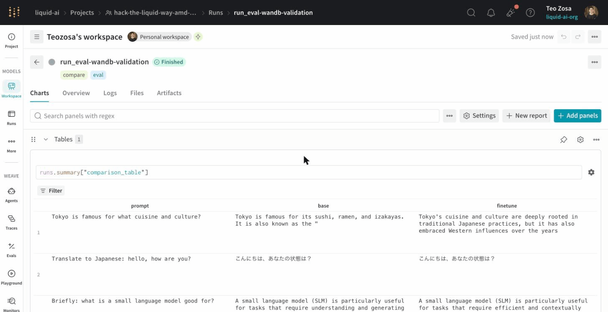

# Demo Day Checklist

Sunday, June 7. Demo session 13:00, submission deadline 12:30 JST.

## What judges score (from the [event guide](https://www.notion.so/370cbef042ad8120b019f78c480e41d8))

| Criterion | What it means |
|---|---|
| **Fit to Challenge** | Alignment with the theme; relevance to Japan's AI landscape; fresh perspective |
| **Creativity and Design** | Originality, elegant design, creative use of AI techniques |
| **Utility** | Real-world usefulness; impact in society or industry |
| **Quality + Completeness + Technical Depth** | Execution quality; how well AI is applied / engineered |

## What to submit

Upload everything to the shared Google Drive folder named **`TEAMNAME_HackTheLiquidWAY_DemoAssets`**.
Encrypt the folder; share the password with **`@liquid-yan`** on Discord.

### 1. Slide deck (2-4 slides)

- **Tagline** (1-2 lines): one sentence that captures the project's essence.
- **Technical summary**: model used, framework, compute setup, training duration, latency numbers,
  architecture diagram (one clean visual beats three messy ones).
- **Results**: comparison of base vs fine-tune.
  - **Text track**: [`scripts/run_eval.py`](scripts/run_eval.py) generates a markdown comparison table of side-by-side completions; with `--wandb` it also logs a `comparison_table` panel (screenshot either):

    
  - **Audio track**: [`scripts/run_eval_audio.py`](scripts/run_eval_audio.py) synthesizes the same prompts through base + fine-tune and writes WAV pairs to `./eval_audio/`; embed both in the deck (or link to the W&B run URL, which logs them as side-by-side `wandb.Audio` entries with inline players). CUDA only: run it on HF Jobs (`l4x1`, ~$0.15; exact command in [README → Understanding Results](README.md#-understanding-results)) or a Colab GPU.
- **Demo screen captures**: a few high-res shots of the working UI + your team.

### 2. Model + data on W&B

- Fine-tuned checkpoint pushed to your team's HF Hub (private repo is fine, just share it with the judges).
  The launcher's `PUSH_TO_HUB=username/repo` env handles this automatically when training finishes.
- W&B run URL (the launchers print this at the top of every log) included in the deck.

### 3. Demo recording

- A 60-90 second screen capture of the working demo, in case the live one hits issues.
- Include both the UI and what's happening behind it (loss curves, generation outputs, on-device latency).

### 4. `README.txt`

Inside the asset folder, a short `README.txt` listing what each file is and how to run the demo.

## Live demo flow (3-5 minutes per team)

Rough script:

1. **Hook** (15-30s): what's the problem, why does it matter for Japan?
2. **Approach** (30-60s): which LFM you fine-tuned + why + what dataset + how long.
3. **Demo** (90-150s): show the UI working, ideally on the assigned **AMD Ryzen AI PC** (see
   [`examples/on_device/`](examples/on_device/) for the setup).
4. **Results** (15-30s): the comparison table or a metric that moved.
5. **Wrap** (10s): what you'd build next given more time.

Practice the timing once. A slide that's still loading when you start talking eats 20s you don't have.

## Pre-demo checklist

- [ ] Fine-tuned model pushed to HF Hub
- [ ] Demo UI (Gradio app or CLI) loads the HF Hub model successfully on the assigned laptop
- [ ] If the assigned laptop is Krackan / Hawk Point and your demo is audio: have a pre-recorded fallback
- [ ] Slides exported as PDF (in case PowerPoint / Keynote misbehaves on the demo machine)
- [ ] Demo recording saved to the asset folder
- [ ] Encrypted folder password sent to `@liquid-yan`
- [ ] W&B run URL pasted into the slides

## Judges from the event guide

- Teo Narboneta Zosa (Liquid AI Japan, MTS)
- Kohsei Matsutani (Liquid AI Japan, MTS)
- Hirosei Kuruma (WAY Equity Partners)
- Mitsuhiko Tomita (WAY Equity Partners)

Pitch to humans, not to the rubric. The rubric is what they fill in afterward.
