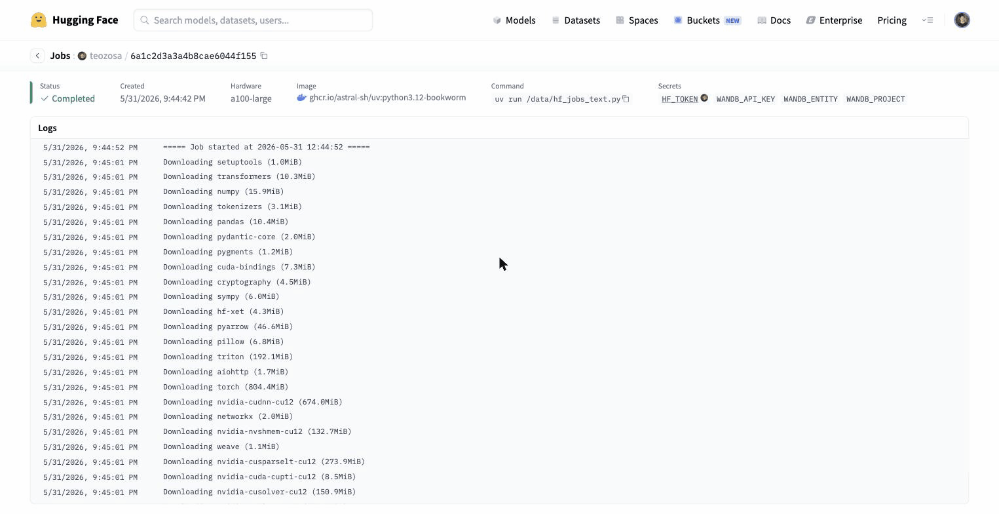
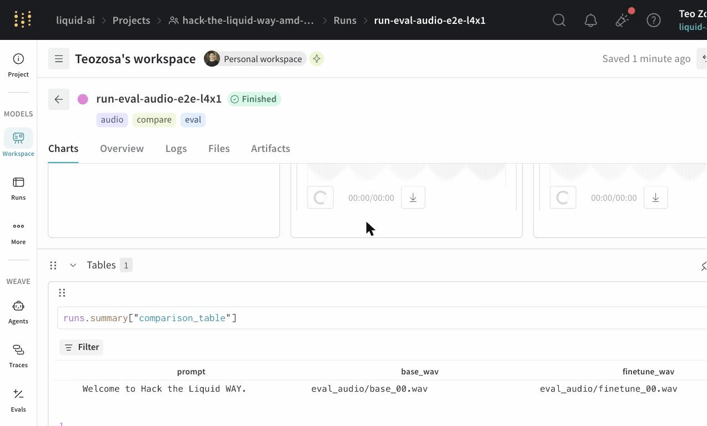
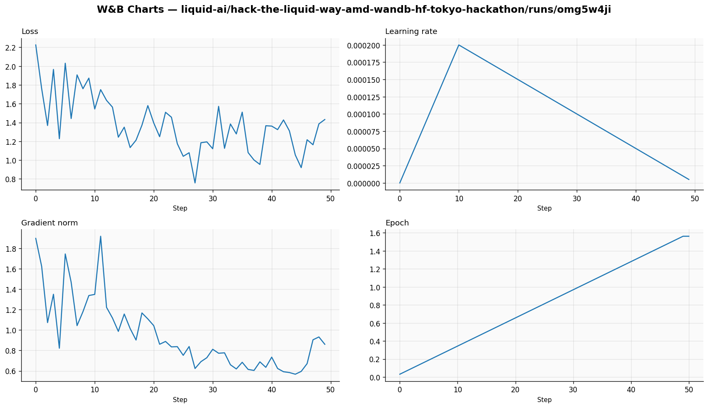
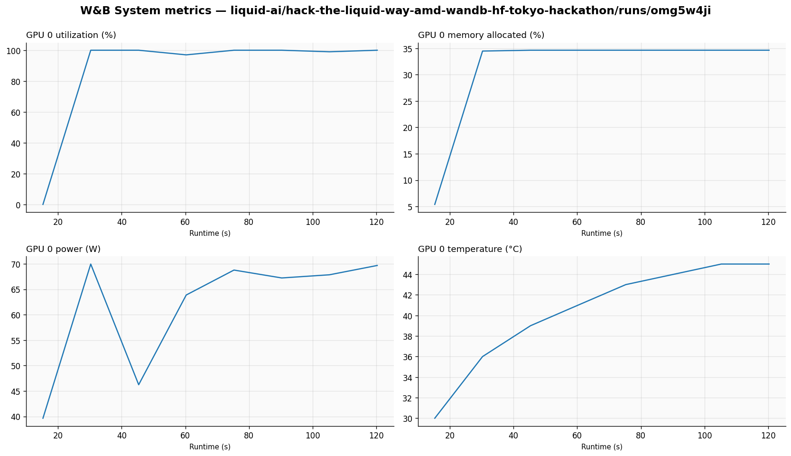
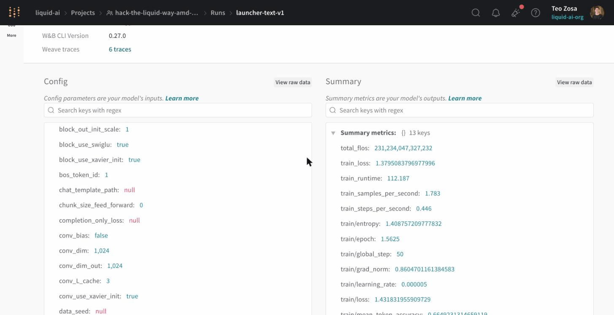
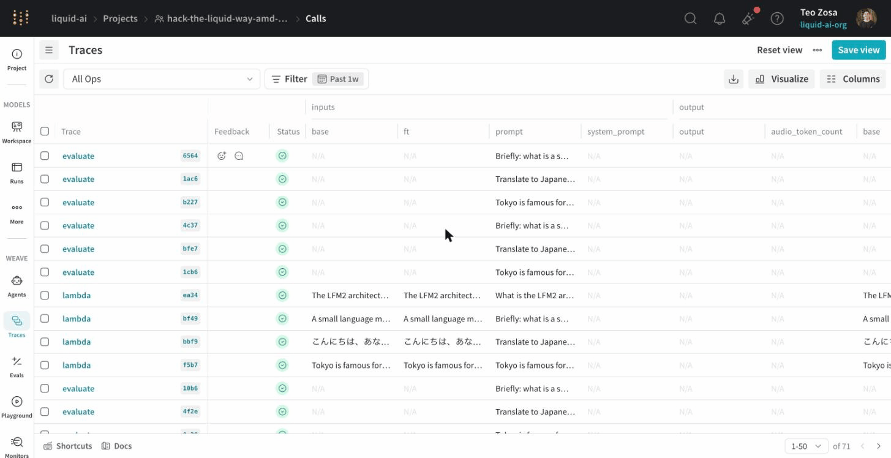
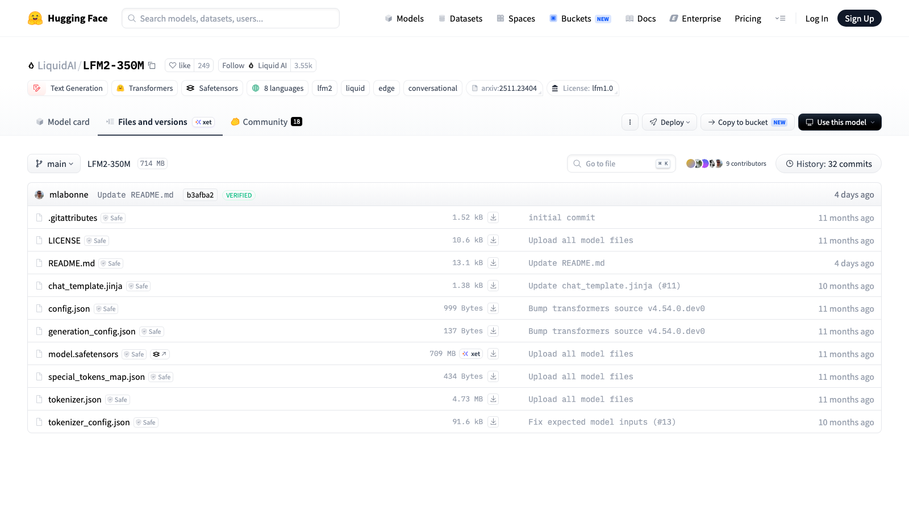

# 🚀 Hack the Liquid WAY (Tokyo, June 2026)

Starter kit for the **Liquid AI × Weights & Biases × WAY × AMD** Tokyo hackathon, June 6 to 7, 2026. Fine-tune the
[LFM2 family](https://huggingface.co/LiquidAI/collections) with **W&B Models + Weave** observability, then deploy it
on an on-site **AMD Ryzen AI PC** for the demo.

> 📅 [Register on Luma](https://luma.com/7fjlam5k) · 💬 [Discord](https://discord.gg/WjgTAr9E) · 📖 [Full event guide (Notion)](https://www.notion.so/370cbef042ad8120b019f78c480e41d8) · 🎟️ $150 HF credit for registered teams

## ⚡ TL;DR: your first run in 5 commands

```bash
git clone <this-repo-url> && cd liquid-ai-way-amd-huggingface-wandb-tokyo-hackathon-2026
make install                                # uv sync (install dependencies)
cp .env.example .env && $EDITOR .env        # fill in HF_TOKEN, WANDB_API_KEY, WANDB_ENTITY (see below)
make validate                               # confirm auth + push perms before any paid GPU
make smoke-text                             # ~3 min on Mac MPS; validates local stack
./scripts/text/launch_hf_job.sh             # submit text fine-tune (or audio counterpart, below)
```

Grab credentials:

- **HF_TOKEN** → [huggingface.co/settings/tokens](https://huggingface.co/settings/tokens). Use a **fine-grained** token with **write** scope to your namespace. Default tokens are read-only and `PUSH_TO_HUB` will 403.
- **WANDB_API_KEY** → [wandb.ai/authorize](https://wandb.ai/authorize)
- **$150 HF credit** → claim link shared with registered teams (sign up with your hackathon-registration email first)

Audio track: swap the last command for `./scripts/audio/launch_hf_job.sh`. Local audio smoke needs a CUDA box (`make smoke-audio`); on a Mac, `make smoke-text` covers the general stack and HF Jobs covers audio. Full setup and workflow below.

## 🎯 What's Inside

Two fine-tuning tracks that run on HuggingFace Jobs (the hackathon's compute provider):

- **Text** ([`examples/text/`](examples/text/)): LFM2 / Liquid Nanos. The production launcher runs TRL `SFTTrainer` +
  PEFT LoRA; submit with `./scripts/text/launch_hf_job.sh`. The
  [`text_finetune_walkthrough.ipynb`](examples/text/text_finetune_walkthrough.ipynb) is a Colab-runnable Unsloth +
  bnb-4bit walkthrough for learning the steps.
- **Audio** ([`examples/audio/`](examples/audio/)): LFM2.5-Audio-1.5B TTS fine-tuning (the base model also handles
  ASR / speech-to-speech inference unchanged). Built on the upstream
  [liquid-audio](https://github.com/Liquid4All/liquid-audio) reference recipe. Submit with
  `./scripts/audio/launch_hf_job.sh`.

Both tracks share:

- **W&B + Weave observability** (scalar logs + system metrics from training; traced `@weave.op` evals via `scripts/run_eval.py`)
- **Canonical sampling recipe** baked in (see [§Pitfalls](#-pitfalls--canonical-recipes))
- **Pre-flight smoke test** (`make validate`) to catch missing credentials before they cost credit
- **On-device demo path** (AMD Ryzen AI PC via llama.cpp / `liquid-audio`)

Model menu: [LFM2 base](https://huggingface.co/collections/LiquidAI/lfm2-686d721927015b2ad73eaa38) ·
[Liquid Nanos](https://huggingface.co/collections/LiquidAI/liquid-nanos-68b98d898414dd94d4d5f99a) ·
[LFM2-VL](https://huggingface.co/collections/LiquidAI/lfm2-vl-68963bbc84a610f7638d5ffa) ·
[LFM2.5-Audio-1.5B](https://huggingface.co/LiquidAI/LFM2.5-Audio-1.5B)

## 🛠️ Setup

The TL;DR commands above are the whole flow; details per step:

1. **Install**: `make install` needs [uv](https://docs.astral.sh/uv/getting-started/installation/) (one-line installer; or Homebrew / pipx). It runs `uv sync` (creates `.venv` with all text-track deps). Type `make` (no args) any time to see the full command list.
2. **Credentials**: `cp .env.example .env` and follow the comments in the file; every entry links to the page that issues it. The one that bites people: HF's default tokens are **read-only**; issue a fine-grained token with **write** access or `PUSH_TO_HUB` fails with 403 at the end of a paid run.
3. **Credit**: sign up at HuggingFace with your hackathon-registration email, claim the $150 credit with the link shared with registered teams, verify at [huggingface.co/settings/billing](https://huggingface.co/settings/billing).
4. **Validate**: `make validate` checks credentials + auth + imports in ~15 s, before anything costs credit. Audio track: `uv sync --extra audio && make validate-audio` (the audio deps are an opt-in extra so the kit stays light for text-only teams).

## ☁️ Run Training on HuggingFace Jobs

The recommended path for hackathon teams. HF Jobs spins up ephemeral GPU containers, runs your script, streams logs to
W&B, and bills per-minute against your $150 credit.

### Quickstart

```bash
# Submit the LFM2 fine-tune to a 1x A100 80GB (default), billed to your account
./scripts/text/launch_hf_job.sh
```

The helper script reads `HF_TOKEN` and `WANDB_API_KEY` from `.env`, sets a sane `--timeout`, and forwards them to the
container as secrets. Override flavor or timeout via env vars:

```bash
HF_FLAVOR=l40sx1 HF_TIMEOUT=4h ./scripts/text/launch_hf_job.sh
```

After submitting, the job's dashboard page (URL printed by the launcher) shows status, hardware, the
secrets that arrived (names only, never values), and live logs:



### Recommended hardware vs workload

| Workload | Flavor | $/hour | What $150 buys |
| --- | --- | --- | --- |
| LFM2-350M / 1.2B SFT or LoRA fine-tune | `a100-large` (1× A100 80 GB) | $2.50 | ~60 h |
| LFM2-1.2B full fine-tune, faster iteration | `l40sx1` (1× L40S 48 GB) | $1.80 | ~83 h |
| Synthetic data generation, TTS inference | `l4x1` (1× L4 24 GB) | $0.80 | ~187 h |
| Lightweight LLM inference, eval scripts | `t4-medium` (16 GB) | $0.60 | ~250 h |
| LFM2-VL batched inference | `a10g-large` (1× A10G 24 GB) | $1.50 | ~100 h |
| Multi-GPU fine-tune (rare) | `a100x4` (4× A100 80 GB) | $10.00 | ~15 h |

Source: [HuggingFace Jobs pricing](https://huggingface.co/docs/hub/jobs-pricing). Billing is per-minute, charged only
while the Job is **Starting** or **Running**. Build time and failed Jobs are free.

### Burn-rate guardrails

- **Always set `--timeout`**. The launcher defaults to `1h` (text) / `2h` (audio); override with `HF_TIMEOUT=<duration>`.
  Worst-case burn = timeout × the flavor's hourly rate (table above).
- **Cancel idle Jobs**: `hf jobs cancel <job-id>`.
- **Watch billing**: [huggingface.co/settings/billing](https://huggingface.co/settings/billing) → "Compute Usage".
- **Browse available flavors + pricing**: [huggingface.co/docs/hub/jobs-pricing](https://huggingface.co/docs/hub/jobs-pricing).

## 📝 Text Fine-tuning Track

For teams targeting **LFM2 / Liquid Nanos** (text fine-tunes for translation, RAG, structured extraction, tool
calling), the [`examples/text/`](examples/text/) directory has the carried-over 2025 reference workflow updated for
HF Jobs:

```bash
uv sync                                                 # install text deps
HF_FLAVOR=a100-large ./scripts/text/launch_hf_job.sh         # submit to HF Jobs
```

Workflow: TRL SFTTrainer + PEFT LoRA on `FineTome-100k-dedup` (or your own dataset; `DATASET_MAPPER=` handles custom
column shapes). The merged checkpoint is saved to `OUTPUT_DIR` and (optionally) pushed to `PUSH_TO_HUB`. Afterwards,
[`scripts/run_eval.py`](scripts/run_eval.py) compares base vs fine-tune with `@weave.op`-traced generations and a
W&B `comparison_table`.

**Pedagogy:** the [`examples/text/text_finetune_walkthrough.ipynb`](examples/text/text_finetune_walkthrough.ipynb)
notebook is the narrative version, runnable in Colab end-to-end. The production script the launcher uploads to
HF Jobs is [`scripts/text/train.py`](scripts/text/train.py).

## 🎙️ Audio Fine-tuning Track

For teams targeting **LFM2.5-Audio-1.5B**, the [`examples/audio/`](examples/audio/) directory has a ready-to-run
**TTS fine-tuning** workflow built on the upstream
[liquid-audio](https://github.com/Liquid4All/liquid-audio) reference recipe. (The base model also supports ASR
and speech-to-speech inference; the kit's recipe is TTS-only, but those tasks work at inference against the
base model.)

```bash
uv sync --extra audio                                   # install audio deps
HF_FLAVOR=a100-large ./scripts/audio/launch_hf_job.sh   # submit to HF Jobs
```

Workflow: preprocess the Jenny TTS dataset (~5 min) → fine-tune (~50 min on 1× A100 80GB at the reference recipe). The
upstream defaults (bs=64, ctx=256, lr=1e-4, max-steps=5000) are sensible starting points; ablate from there.

**Pedagogy:** the [`examples/audio/audio_finetune_walkthrough.ipynb`](examples/audio/audio_finetune_walkthrough.ipynb)
notebook narrates the same workflow cell-by-cell with explanations of `ChatMessage` plumbing, Mimi codebooks, the
trainer's defaults, post-train TTS inference, and the HF Hub push. Runnable in Colab end-to-end with a small slice of
the dataset for fast iteration.

**Recipe + deployment**: [examples/audio/README.md](examples/audio/README.md) has hardware sizing,
bring-your-own-dataset iterator guidance, W&B wiring notes, and §5 deploy paths (local TTS inference, Hub push,
Gradio demo, on-device).

## 🎮 Configuring Your Run

The production launchers (`scripts/text/launch_hf_job.sh` and `scripts/audio/launch_hf_job.sh`) accept the common training knobs (model, dataset, hyperparameters, push target) via environment variables. The full list lives at the top of [`scripts/text/train.py`](scripts/text/train.py) (text) and [`scripts/audio/train.py`](scripts/audio/train.py) (audio).

**Two important exceptions** where you still need a source edit (each described in its track's README):

- **Text dataset shape:** auto-detected for `messages`, `conversations`, `instruction+{output,response}[+context]`, and `inputs+targets` rows. Other layouts need `DATASET_MAPPER="user=col,assistant=col[,system=col]"` (env-var override) OR an `elif` in `_to_messages` ([`scripts/text/train.py`](scripts/text/train.py)).
- **Audio dataset:** no `DATASET=` env var. Your data is wired through a small iterator you write: `TrainingSamples` in [`scripts/audio/train.py`](scripts/audio/train.py) yields `list[ChatMessage]` per sample (system voice prompt, user text, assistant audio). Rewrite its `__iter__` and voice prompt for your data, about 15 lines. Full guide in the [audio track README](examples/audio/README.md).

The most common overrides:

```bash
# Text track: swap base model, dataset, training length
MODEL_ID=LiquidAI/LFM2-700M \
DATASET=kunishou/databricks-dolly-15k-ja \
DATASET_SLICE=2000 \
MAX_STEPS=500 \
BATCH_SIZE=4 \
LR=2e-4 \
PUSH_TO_HUB=your-username/your-finetune \
  ./scripts/text/launch_hf_job.sh

# Audio track: training length + push target (dataset AND its voice prompt = your iterator, see above)
MAX_STEPS=5000 \
PUSH_TO_HUB=your-username/your-tts-finetune \
  ./scripts/audio/launch_hf_job.sh
```

Env vars the launcher reads from `.env` (no need to repeat on the command line): `HF_TOKEN`, `WANDB_API_KEY`, `WANDB_ENTITY`, `WANDB_PROJECT`.

Each launcher prints its resolved config + the W&B run URL at startup, so you can confirm settings landed before the GPU clock starts ticking.

### Customizing the training loop

To change the LoRA recipe, callbacks, or sampling, edit [`scripts/text/train.py`](scripts/text/train.py) directly. It's a self-contained UV script: declare deps inline in the `# /// script` block (there, not in `pyproject.toml`), and the launcher uploads it to HF Jobs.

The text launcher uses LoRA with the canonical recipe (`r=16, alpha=32, dropout=0`, all-linear targets); the audio launcher uses a full bf16 fine-tune per the liquid-audio reference. Both lock their hyperparameters to upstream sources; see [§Pitfalls + Canonical Recipes](#-pitfalls--canonical-recipes).

## 📊 Understanding Results

### While the job runs

```bash
make logs JOB=<job-id>      # tail HF Jobs logs (job ID printed at submit)
```

The launcher prints the HF Jobs URL and W&B run URL when it submits.

### After the job finishes

```bash
make verify RUN=<wandb-run-name>                          # required-only checks
make verify RUN=<wandb-run-name> HF_REPO=user/your-repo   # also confirm Hub push
```

[`scripts/verify_run.py`](scripts/verify_run.py) is a post-train auditor. It
confirms the W&B run reached `finished` state, every required scalar metric
has non-null samples, system metrics landed (the GPU was actually used), and
(when `HF_REPO=` is set) that the exact commit your training pushed is on the
Hub. It exits 0 only if all gates pass; "script exited 0" alone is not proof
the run succeeded.

### Base-vs-finetune comparison (for the demo)

**Text track:**

```bash
uv run python scripts/run_eval.py \
  --base LiquidAI/LFM2-350M \
  --finetune <your-username>/<your-finetune> \
  --wandb
```

[`scripts/run_eval.py`](scripts/run_eval.py) generates side-by-side text
completions and writes a `wandb.Table` your demo deck can screenshot.

**Audio track** (CUDA only: liquid_audio's decode is CUDA-only upstream, so run this on HF Jobs, ~$0.15 on `l4x1`):

```bash
bash -c 'source ./scripts/shared/_load_env.sh && _load_env .env && \
  uv run --no-sync hf jobs uv run --flavor l4x1 --timeout 30m \
    --secrets HF_TOKEN --secrets WANDB_API_KEY \
    --env WANDB_ENTITY=$WANDB_ENTITY --env WANDB_PROJECT=$WANDB_PROJECT \
    --env FINETUNE=<your-username>/<your-audio-finetune> --env WANDB=1 \
    --detach scripts/run_eval_audio.py'
```

[`scripts/run_eval_audio.py`](scripts/run_eval_audio.py) synthesizes the
same text prompts through base + fine-tune, saves WAV pairs to
`./eval_audio/`, and logs them as side-by-side `wandb.Audio` entries with
inline players in the W&B dashboard. (On a CUDA box / Colab GPU it also
runs directly: `uv run --extra audio python scripts/run_eval_audio.py
--finetune ... --wandb`.) What lands in the dashboard:



### W&B Dashboard

**Training metrics** (loss, learning rate, GPU usage):



**System metrics** (GPU utilization and memory):



**Model artifacts** (saved checkpoints and metadata):



### Weave UI

One `@weave.op` trace per prompt from [`scripts/run_eval.py`](scripts/run_eval.py), with inputs and outputs:



### After the push: HF Hub

Trained checkpoint files on your repo after `PUSH_TO_HUB`:



## 🩺 Pitfalls + Canonical Recipes

Quick cheat-sheet below. For the full error → fix map see [`TROUBLESHOOTING.md`](TROUBLESHOOTING.md); for the recipes-with-sources table see [`AGENTS.md`](AGENTS.md#canonical-recipes--quote-dont-invent).

### Canonical sampling: quote the model card

```python
# Per https://huggingface.co/LiquidAI/LFM2-350M
model.generate(
    input_ids,
    do_sample=True, temperature=0.3, min_p=0.15, repetition_penalty=1.05,
    max_new_tokens=512,
)
```

No `top_p`, no `top_k`, no greedy. Greedy + no penalty = `"TokTokTok…"` doom loops.

### Always use the chat template

```python
inputs = tokenizer.apply_chat_template(
    [{"role": "user", "content": prompt}],
    add_generation_prompt=True, return_tensors="pt", tokenize=True,
    return_dict=True,   # transformers 5.x returns BatchEncoding
).to(model.device)
model.generate(**inputs, ...)
```

Raw text bypasses the system/user/assistant scaffolding and collapses output.

### After `trainer.train()`: `model.eval()`

```python
trainer.train()
trainer.model.eval()   # Unsloth's FastModel.for_inference() does this. Raw PEFT doesn't.
```

Skip this and post-LoRA inference doom-loops even with the canonical sampling recipe.

### LoRA recipe: alpha = 2 × r

```python
# Per https://docs.liquid.ai/lfm/fine-tuning/unsloth
r=16, lora_alpha=32, lora_dropout=0,
target_modules=["q_proj","k_proj","v_proj","o_proj","gate_proj","up_proj","down_proj"],
```

TRL variant: same `r`/`alpha`; `lora_dropout=0.05`; attention-only targets; `lr=2e-4`; `num_train_epochs=3`.

### Smoke tests use real data + LoRA

Toy 4-sample + full fine-tune destroys LFM2's chat capability. Use `mlabonne/FineTome-100k-dedup` slice + LoRA.

## 💡 Tips

1. **Smoke first.** `make validate` (then `--audio` for the audio track) before any HF Job. Every failed Job still has startup cost.
2. **Show, don't tell.** Spin up [`examples/demo/`](examples/demo/) early. Judges see UIs, not loss curves.
3. **Read [`DEMO_DAY.md`](DEMO_DAY.md) on day 1.** The submission spec is non-trivial.

## 🔗 Resources

- 📖 [Event guide (Notion)](https://www.notion.so/370cbef042ad8120b019f78c480e41d8)
- 💧 [Liquid AI](https://www.liquid.ai/) · [LFM on HuggingFace](https://huggingface.co/LiquidAI) · [LEAP](https://leap.liquid.ai)
- 📚 [HuggingFace Jobs docs](https://huggingface.co/docs/hub/jobs) · [Jobs pricing](https://huggingface.co/docs/hub/jobs-pricing)
- 🧪 [W&B docs](https://docs.wandb.ai/) · [Weave docs](https://weave-docs.wandb.ai/)
- ⚡ [Unsloth](https://github.com/unslothai/unsloth)
- 🤗 [HuggingFace Transformers](https://huggingface.co/docs/transformers)

## 🤝 Support

- **Hackathon channel**: [Discord server](https://discord.gg/WjgTAr9E)
- **Liquid AI community**: [main Discord](https://discord.gg/74cav966)
- **W&B community**: [Slack](https://wandb.ai/site/slack)
- **Issues**: Open a GitHub issue on this repo

## 📝 License

This example is provided for educational purposes as part of the **Hack the Liquid WAY** hackathon (Tokyo, June 2026).

---

**Happy Hacking! 🎉**

Built with care by Liquid AI, Weights & Biases, WAY Equity Partners, and AMD for the Tokyo Hackathon 2026.
