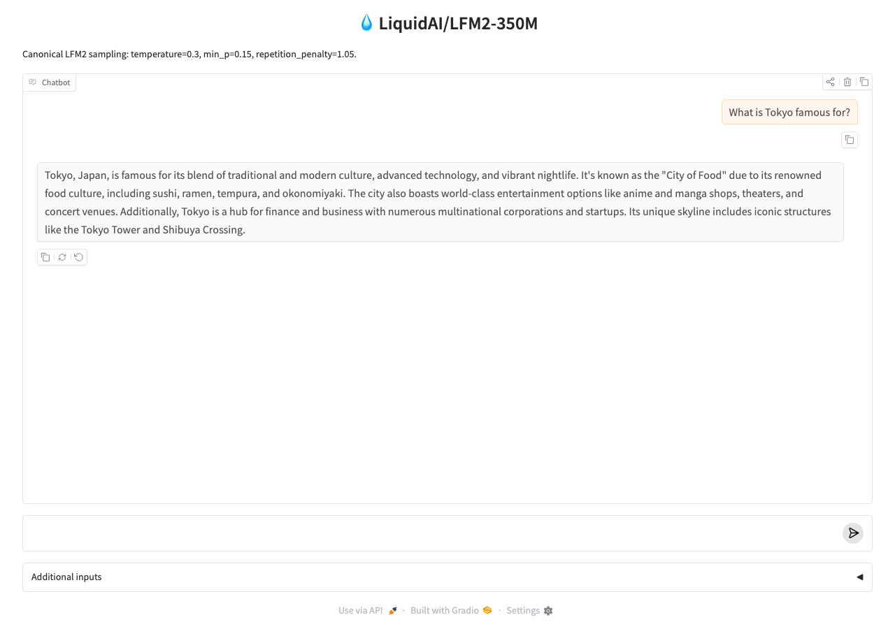

# Demo UIs

A Gradio chat template you can drop your fine-tuned model into and show a judge.

## Quick local preview

### Text chat

```bash
MODEL_ID=your-username/your-finetune uv run --with gradio python examples/demo/text_chat.py
```

Opens http://localhost:7860 with a chat interface using canonical LFM2 sampling (`temperature=0.3, min_p=0.15, repetition_penalty=1.05`). The system prompt is editable so judges can poke at behaviour. Works on any machine (CUDA, Apple Silicon MPS, or CPU). What it looks like:



Two `uv run` notes:
- `--with gradio` adds gradio just for this run. A plain `uv pip install gradio` gets **removed again** by `uv run`'s automatic env sync (gradio isn't a locked kit dependency), so installing it separately silently undoes itself.
- `uv run` (not bare `python`) is required: `make install` doesn't activate `.venv`, so a bare `python` would resolve against the system interpreter and miss `transformers` / the kit's pinned versions.

## Deploy to a HuggingFace Space (recommended for judges to click)

A Space gives judges a live URL they can poke at without your laptop being on. Free CPU Spaces work for LFM2-350M; LFM2-700M / 1.2B need a paid GPU Space tier.

### Text chat → Space

1. **Create an empty Gradio Space** in your namespace (via the [web UI](https://huggingface.co/new-space) or `hf` CLI):
   ```bash
   hf repo create your-username/lfm2-chat --type space --space-sdk gradio --private
   ```
2. **Clone it locally:**
   ```bash
   git clone https://huggingface.co/spaces/your-username/lfm2-chat
   cd lfm2-chat
   ```
3. **Add the demo + a minimal `requirements.txt`:**
   ```bash
   cp /path/to/this-repo/examples/demo/text_chat.py app.py
   cat > requirements.txt <<'EOF'
   gradio>=4.40
   torch>=2.8
   transformers>=4.57.1
   accelerate>=1.0
   EOF
   ```
4. **Set `MODEL_ID` as a Space secret** so the app loads your fine-tune (not the default 350M base). [Web UI](https://huggingface.co/docs/hub/spaces-overview#managing-secrets): Space → Settings → "Variables and secrets" → "New secret". Name `MODEL_ID`, value `your-username/your-finetune`.
5. **Push:**
   ```bash
   git add app.py requirements.txt
   git commit -m "Initial LFM2 chat demo"
   git push
   ```
6. **Watch the build:** Space page → "App" tab. First build is ~3 min (installs torch + transformers + downloads weights); subsequent rebuilds are ~30s.

### Make it public for demo day

`hf repo create ... --private` keeps the Space hidden during dev. Flip it to public via Space → Settings → "Change visibility" before submitting the demo-day URL.

## On-device deploy (AMD Ryzen AI PC)

For the hackathon, run on the assigned AMD Ryzen AI PC instead of a paid GPU Space. See [`examples/on_device/`](../on_device/) for the llama.cpp + Vulkan / FastFlowLM NPU / liquid-audio paths.
